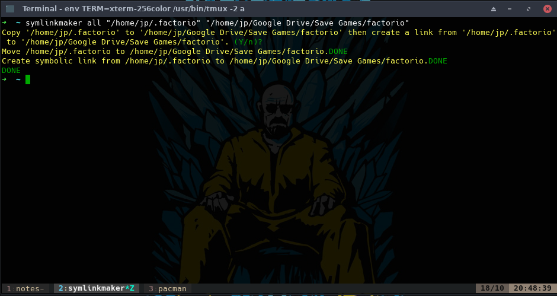

Symlink Maker
============

An overengineered utility that essentially does this:
```sh
    # Move the folder from /source/path to /new/path
    mv -v "/source/path" "/new/path"
    # Create a symbolic link from /source/path pointing to /new/path
    ln -sv "/new/path" "/source/path"
```

## Why?

At first it was a tool to help me backup my games' save files.

I wanted this tool since I was copying manually my save files into my `Google Drive` folder, then creating a symbolic link from the save files location to the new location in the `Google Drive` folder. I wanted to simplify this, so I made this application.

This started as an app I needed and became an app I used to learn since I looked at the code and didn't like it, so I decided to refactor it and use it as a tool to learn:

- Using interface instead of actual objects to reduce coupling 
- How to decouple the UI from the logic correctly again using interfaces
- How to unit test & mock in C#
- Dependency Injection
- S.O.L.I.D principles
- And much more...

## What can it do?

At the time it does basic directory functions
- `Delete`, `Move`, `Create a symlink`, `Copy`

It also combines the `Move` & `Create symlink` function for the actual **main** feature of the app.


## How does it look?

### WPF version


This is actually the initial coupled version, which has not yet changed since I'm only on Linux right now, so even if I change the code, I wouldn't be able to test it.

### Gtk# version


### CLI version

This version does not have an actual interface, at the time only parse the arguments passed and process them.




## What is left to do?

- Implement the WPF GUi correctly (like the Gtk# one)
- Log all actions 
- Repeat or revert the actions using config or log files
- Setup Code Coverage
- Implement i18n
- And much, much more..

